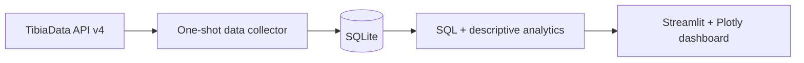

# Tibia World Population Analytics

A reproducible local data project that turns successive snapshots from the TibiaData API into a
historical dataset for understanding how the population of each Tibia world changes over time.

The central question is not only *“How many players are online now?”*, but:

> **How does the population of each Tibia world behave over time?**

This MVP collects reliable history and provides descriptive exploration. It intentionally does not
assign profile labels, scores, or clusters before enough real data exists to understand the
distributions.

## Pipeline and architecture



- **Collector:** one request to `GET /v4/worlds`, defensive validation, retries, logging, and an
  atomic database transaction.
- **Storage:** normalized world metadata, population snapshots, and audited collection runs.
- **Analytics:** SQL for latest-state, time-window, filtering, grouping, averages, peaks, and series;
  pandas complements SQLite for median, sample deviation, and percentiles.
- **Dashboard:** independent, read-only Overview, World Explorer, and Compare Worlds pages.
- **Demo generator:** deterministic synthetic patterns in a separate database, visibly labeled in
  the dashboard.

## Data source discovery

The schema was based on a real live request and the current Swagger definition, not on older
examples. On 2026-09-22, the live endpoint reported TibiaData API v4 release `4.10.0`.

Each overview world currently exposes:

- name, current player count, and status;
- location and PvP type;
- premium-only and transfer restriction;
- BattlEye protection flag and date/release marker;
- game-world type and tournament-world type.

The envelope also exposes the source timestamp, reported global population, historical global record,
and API metadata. `tournament_worlds` may be `null`. See [the full field mapping](docs/API_FIELDS.md).

Source: [TibiaData documentation](https://docs.tibiadata.com/) and
[`GET /v4/worlds`](https://api.tibiadata.com/v4/worlds).

## Stack and Python version

- Python **3.11** recommended (project range: 3.11–3.13)
- requests
- SQLite (Python standard library)
- pandas
- Plotly
- Streamlit
- pytest and Ruff for quality checks

## Quick start

### 0. Clone the repository

```bash
git clone <repository-url> tibia-world-analytics
cd tibia-world-analytics
```

### 1. Create an environment

Windows PowerShell:

```powershell
py -3.11 -m venv .venv
.\.venv\Scripts\Activate.ps1
python -m pip install --upgrade pip
python -m pip install -r requirements.txt
```

Linux/macOS:

```bash
python3.11 -m venv .venv
source .venv/bin/activate
python -m pip install --upgrade pip
python -m pip install -r requirements.txt
```

### 2. Collect one real snapshot

```bash
python -m src.collector
```

This creates `data/tibia_worlds.db`. Repeating the same TibiaData source timestamp is safe and does
not duplicate the run or snapshots. For continuous history, schedule this command every five minutes;
see [scheduling examples](docs/SCHEDULING.md).

Useful collector options:

```bash
python -m src.collector --help
python -m src.collector --db data/custom.db --log-level DEBUG
```

### 3. Open the dashboard

```bash
streamlit run app/dashboard.py
```

Closing Streamlit does not affect scheduled collections. All stored/displayed timestamps are UTC.

## Dashboard

### Overview

- latest total, monitored-world count, mean per world, and last collection time;
- global mean and peak across available samples in the trailing 24 hours;
- total-population time series;
- sortable current-world table with region, PvP, BattlEye, current, 24h average, and 24h peak.

### World Explorer

- 24-hour, 7-day, and 30-day windows;
- current, mean, median, min, max, sample standard deviation, P10/P25/P75/P90;
- observed peak time and population series;
- an explicit limited-history notice when the selected period is not covered.

### Compare Worlds

- up to eight series on one chart;
- the same basic statistics side by side;
- global filters derived from database values for region, PvP type, BattlEye, premium-only,
  transfer type, and game-world type.

## Synthetic demo data

When real history is still short, generate 14 days of five-minute synthetic data:

```bash
python -m src.demo_data
```

The demo includes stable, low-population, pronounced-peak, weekend-sensitive, and shifted-hour worlds.
It is saved to `data/demo_tibia_worlds.db`, while real data remains in `data/tibia_worlds.db`. Choose
**Synthetic demo** in the dashboard sidebar; a persistent warning identifies every displayed value as
synthetic. Existing demo data is never overwritten unless explicitly requested:

```bash
python -m src.demo_data --replace --days 30 --seed 42
```

Synthetic names and values do not represent real Tibia worlds.

## Exploratory notebook

The notebook is an optional workspace for ad-hoc analysis outside the dashboard. Its dependencies
are intentionally separate from the minimal dashboard runtime. Install them and start Jupyter from
the repository root:

```powershell
.\.venv\Scripts\python.exe -m pip install -r requirements-notebook.txt
.\.venv\Scripts\python.exe -m jupyter lab
```

Then open `notebooks/exploratory_analysis.ipynb`. In VS Code, use **Select Kernel → Python
Environments → `.venv`**. To register an explicit kernel named `Python (Tibia World Analytics)`, run:

```powershell
.\.venv\Scripts\python.exe -m ipykernel install --user --name tibia-world-analytics --display-name "Python (Tibia World Analytics)"
```

If the environment was created with `uv` and does not contain `pip`, install with:

```powershell
uv pip install --python .venv\Scripts\python.exe -r requirements-notebook.txt
```

## Database design

| Table | Purpose | Key integrity rule |
|---|---|---|
| `worlds` | Last-seen relatively static metadata | unique case-insensitive world name |
| `population_snapshots` | Historical population and status | unique `(world_id, observed_at)` |
| `collection_runs` | Source/ingestion audit and global totals | unique source `observed_at` |

The API-provided timestamp is the canonical observation time; local ingestion time is stored
separately. Every timestamp is normalized to ISO-8601 UTC with `Z`. A complete collection is written
inside one transaction. See [the detailed schema](docs/DATABASE.md).

## Project structure

```text
app/                    Streamlit Overview and multipage views
src/api.py              HTTP client and defensive response parser
src/database.py         Schema, connections, and atomic persistence
src/collector.py        One-shot collection CLI
src/analytics.py        SQL read model and descriptive statistics
src/demo_data.py        Separate deterministic synthetic dataset
tests/                  Offline parser, persistence, idempotency, and analytics tests
notebooks/              Optional exploratory starting point
docs/                   API discovery, schema, and scheduling notes
data/                   Generated databases (ignored by Git)
```

## Tests and quality checks

Install development dependencies and run:

```bash
python -m pip install -r requirements-dev.txt
pytest
ruff check .
ruff format --check .
```

The test suite is offline: it uses fixtures and temporary SQLite databases, never requiring the API.

## Configuration

- `TIBIA_ANALYTICS_DB`: optional path for the real database.
- `TIBIA_ANALYTICS_DEMO_DB`: optional path for the demo database.
- `--db`: per-command collector/demo database override.

No credentials or secrets are required by the public endpoint.

## Limitations

- The API returns current state, so history begins only when this collector starts running.
- Failed collections create gaps rather than fabricated/interpolated points.
- Metadata is maintained as last-seen state; this MVP does not version historical metadata changes.
- The overview endpoint does not include all fields available from a per-world request; the MVP avoids
  N+1 requests and stores only verified overview fields.
- SQLite is appropriate for a local single-writer MVP, not a distributed ingestion service.
- A short history cannot support reliable weekday/weekend or seasonal conclusions. The dashboard
  labels incomplete requested windows.

## Possible next versions

- average hourly profiles with explicit regional/timezone framing;
- weekday versus weekend distributions and missing-interval quality metrics;
- metadata history and lifecycle/merge handling for worlds;
- data export and retention policies;
- only after enough data: stability, peak intensity, and clustering validated against real
  distributions rather than arbitrary thresholds.

## Disclaimer

Tibia is a registered trademark of **CipSoft GmbH**. This is an independent, unofficial portfolio
project and is not affiliated with, endorsed by, or sponsored by CipSoft. Data is accessed through
the public TibiaData API; follow its terms and operational guidance.
